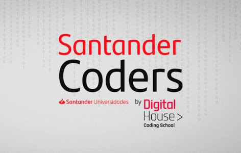

# Exercícios JS da 2ª fase do Programa [Santander Coders Mobile](https://www.becas-santander.com/pt/program/santandercodersmobile2020) (Jul/2020) pela plataforma [Digital House](https://bolsas-br.digitalhouse.com/br/login)

Se tratou de um curso on-line da fase de nivelamento do programa de bolsas **Santander Mobile**. Os exercícios são **scripts JS** que englobam os **fundamentos de programação**.